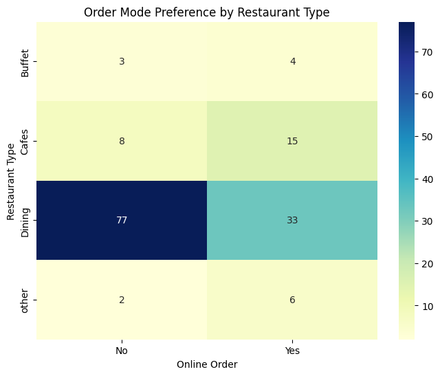

🍽️ Zomato Data Analysis Using Python
📌 Project Overview

This project performs exploratory data analysis (EDA) on Zomato restaurant data using Python in Google Colab. The objective is to understand customer preferences, restaurant trends, pricing behavior, and online ordering patterns through data visualization.

🎯 Objectives

Analyze restaurant categories and popularity

Compare online and offline ordering trends

Study rating distribution and customer satisfaction

Identify preferred price range for couples

Understand how pricing and service mode affect ratings

🧰 Tools & Technologies

Python

Google Colab

Pandas – Data manipulation

NumPy – Numerical operations

Matplotlib – Basic data visualization

Seaborn – Advanced statistical visualization

📂 Dataset

Zomato restaurant dataset (CSV format)

Includes: restaurant name, ratings, votes, order mode, cost for two people, and restaurant type

🔄 Data Cleaning

Removed denominators from the rating column (e.g., 4.1/5 → 4.1)

Converted ratings into numeric format

Verified dataset consistency and missing values

📊 Analysis & Visualizations
1️⃣ Restaurant Type Distribution

2️⃣ Votes by Restaurant Type

3️⃣ Average Rating by Restaurant Type

4️⃣ Online vs Offline Order Availability

5️⃣ Ratings Distribution

6️⃣ Cost Preference for Couples

7️⃣ Ratings Comparison (Online vs Offline)

8️⃣ Order Mode vs Restaurant Type (Heatmap)

9️⃣ Cost vs Rating Relationship

🔍 Key Insights

Dining restaurants dominate the dataset and get the highest number of votes

Offline orders are more common overall, while cafes prefer online orders

Most ratings are between 3.5–4, indicating generally positive feedback

Restaurants offering online orders receive higher ratings

Couples prefer restaurants costing around ₹300

Cost alone does not guarantee higher ratings

Cafes have slightly higher average ratings despite fewer votes

